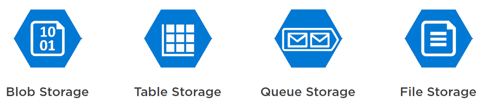
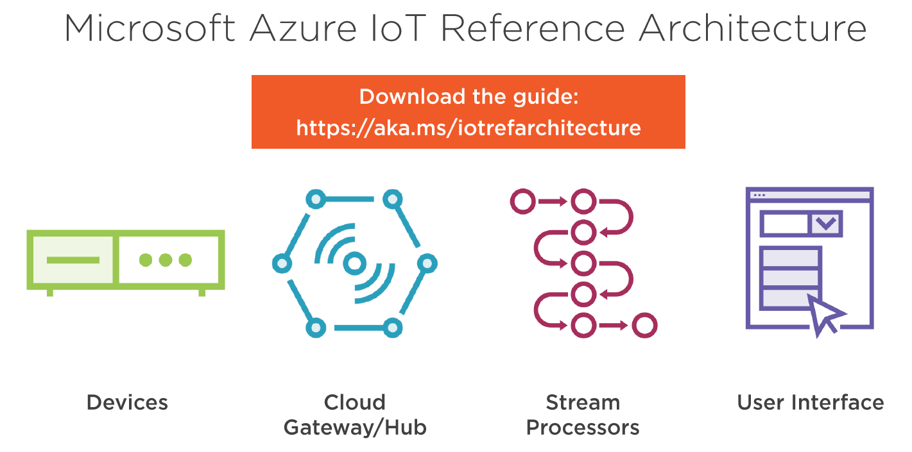
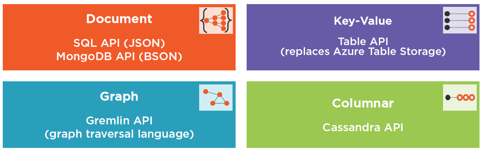
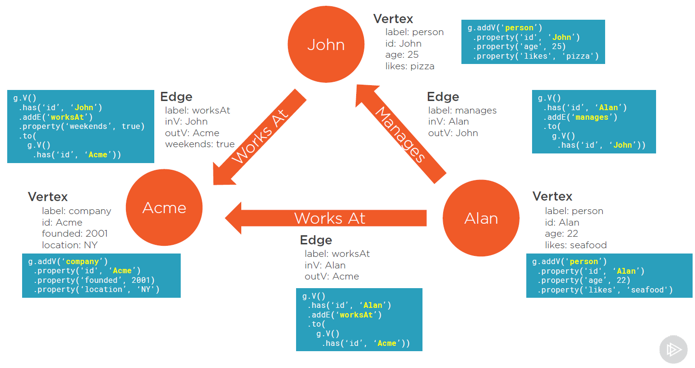
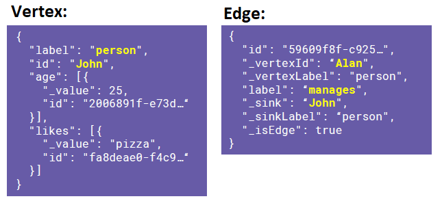
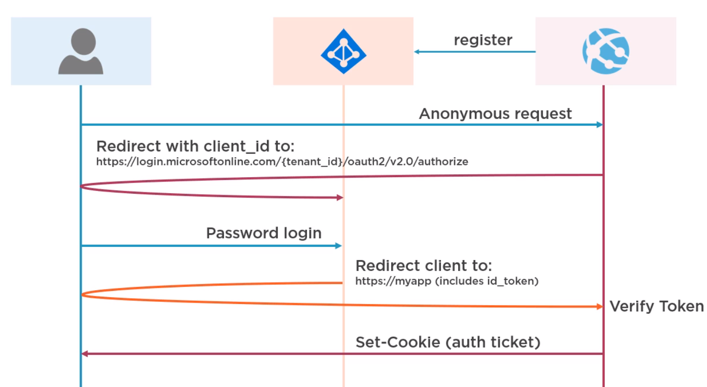
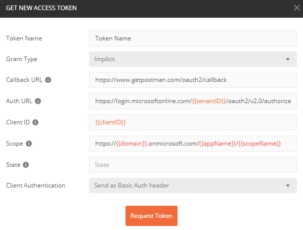

# Azure Services:

## 1. App Services:

- Scaling:

  - Scaling Up - more power
  - Scaling Out - more instances

- How to edit App Service files:

  - Kudu
  - App Service Editor - from Azure Portal
  - Cloud Explorer - from Visual Studio

---

## 2. Azure Storage:

<p align="center"></p>

- **SAS** - Shared Access Signatures - "_grants you limited access to objects in your storage account to other clients, without exposing your account key_" - easy way to pass storage objects between apps/services

## 3. Azure Functions & Logic Apps:

## 4. IoT - notes based on Pluralsight course - [Microsoft Azure Developer: Creating IoT Solutions](https://app.pluralsight.com/library/courses/microsoft-azure-iot-solutions-creating/table-of-contents):

- According to the [Microsoft IoT architecture guideline](http://aka.ms/iotrefarchitecture) there are 4 main parts of an IoT architecture:

  - Devices
  - Hubs (e.g. IoT Hub)
  - Data analytics (e.g. Stream Analytics)
  - Visualization (e.g. TSI)

    <p align="center"></p>

- Simulating devices:

  - > az extension add --name azure-cli-iot-ext
  - > az iot device simulate -n hub-name -d device-name --data "Message" --msg-count 5 --msg -interval 10
  - https://azure-samples.github.io/raspberry-pi-web-simulator/

- Basic communication types: **C2D** (cloud-to-device) & **D2C** (device-to-cloud)

- VS Code extension - **Azure IoT Hub Toolkit Extension**

### 4.1. [IoT Hub](https://docs.microsoft.com/en-us/azure/iot-hub/):

- **DPS** – Device Provisioning Service – Azure service for automation of adding new devices to Hub

- IoT Hub routing – allows you to send your data to multiple directions (e.g. blob storage backup)

### 4.2. [Stream Analytics](https://docs.microsoft.com/en-us/azure/stream-analytics/):

- **Key concepts**: Inputs (data from Storage or Hubs), Outputs (Storage, DBs, Hubs, Functions, etc.), Functions (udf), Query

- Example goals of stream analytics: data reduction, anomaly detection, change detection

- [VS Extension](https://marketplace.visualstudio.com/items?itemName=ADLTools.AzureDataLakeandStreamAnalyticsTools)

- **UDF** - User Defined Functions - JS functions that you can reffer to in Stream Analytics code, e.g.:
  > SELECT \*, udf.guid() as RowKey

### 4.3 [TSI](https://docs.microsoft.com/en-us/azure/time-series-insights/) - Time-series insights:

- TSI = Storage + Analytics + Visualisation

---

## 5. Cosmos DB - notes based on Pluralsight course - [Learning Azure Cosmos DB](https://app.pluralsight.com/library/courses/azure-cosmos-db/table-of-contents):

- CosmosDB is build upon **4 data models** that are connected with 5 API:

    <p align="center"></p>

- CosmosDB Emulator - for a testing and development purpose you can use [CosmosDB local emulator](aka.ms/cosmosdb-emulator)

### 5.1 Graph API:

- **Building blocks** - Graph API is based on **Vertexes & Edges** which are Entities & Relationships. All vertexes & edges consists **ids** and **labels**, edges consist also **cardinality** - information about source (vertedId) and target (\_sink).

- Edges are always attached to source vortex (e.g. in case of partitioning). For bidirectional relationship define 2 edges

- Gremlin ([syntax](https://docs.microsoft.com/en-us/azure/cosmos-db/gremlin-support#gremlin-steps)) - query language based on GraphSON and [Apache TinkerPop](http://tinkerpop.apache.org/)
    <p align="center"></p>
    <p align="center"></p>

---

## 6. Cognitive Services:

- Images:

  - Face API
  - Verificaiton API
  - [Custom Vision](https://www.customvision.ai/) - custom/personalize object detection (good for domain specific classification)

- Text:
  - [LUIS](https://www.luis.ai/home) (Language Understanding) - NPL

---

## 7. Active Directory & Key Vault - [overview](https://developer.okta.com/blog/2018/03/23/token-authentication-aspnetcore-complete-guide#validate-tokens-in-aspnet-core):

### Authentication with [OpenID Connect](https://connect2id.com/learn/openid-connect):

<p align="center"></p>

### In ASP.NET apps there are 3 places where you have to set up Authentication:

1. **Startup.cs -> Configure()** - information for HTTP methods "look for auth tokens in cookies":

   ```csharp
    app.UseAuthentication();
   ```

2. **Startup.cs -> ConfigureServices()** - general configuration for JWT tokens:

   ```csharp
    services.AddAuthentication(JwtBearerDefaults.AuthenticationScheme)
        .AddJwtBearer(options =>
        {
            // ApplicationIDURI - https://{domainName}.onmicrosoft.com/{appName}
            options.Audience = Configuration["AzureAd:ApplicationIDURI"];
            options.Authority = $"{Configuration["AzureAd:Instance"]}{Configuration["AzureAd:TenantId"]}"
        });

        // Default but problematic :(
        //services.AddAuthentication(AzureADDefaults.BearerAuthenticationScheme)
        //    .AddAzureADBearer(options => Configuration.Bind("AzureAd", options));
   ```

3. **Startup.cs -> ConfigureServices()** or in Controllers - here you can add global auth filter/policy (this can be also done by attributes like [Authorize]):
   ```csharp
    services.AddMvc(options =>
      {
        var policy = new AuthorizationPolicyBuilder().RequireAuthenticatedUser().Build();
        options.Filters.Add(new AuthorizeFilter(policy));
      })
   ```

### Postman configuration:
1. In Azure set Redirect URIs to: *https://www.getpostman.com/oauth2/callback*
2. In Azure AD set manifest "oauth2AllowImplicitFlow" to *true*
3. Configure Postman:
<p align="center"></p>

## **Key vault**

Pretty straight forward. For defined **keys** and **secrets** you get **Identifiers** that can be used like:

> @Microsoft.KeyVault(SecretUri=**{keyVaultIdentifier}**)

---
