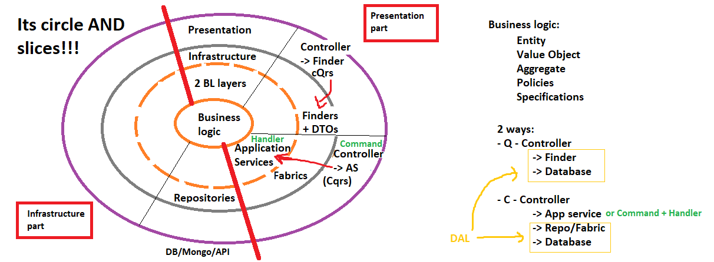

## DDD & Modeling software:

Software development - building domain logic **model** (like CAD model) 
**Domain model is what client is paying for** 
DDD makes sense only for **non-trivial domains** (non CRUD domains) - here DDD is very usefull (test: when you have simple interface but complicated logic - e.g. banks) 
**BL patterns**: TS - transactrion script (1 service, 1 entity), DM - Domain Model

---

### Building blocks in DDD:

1. Domain/Business logic:

   - Entity - has its own identity (e.g. Customer); **Creating entities without logic is not OOP but procedural programming**
   - Value object - has NOT its own identity (e.g. Address)
   - Aggregate - set of entities and value objects that perform the same function
     - aggregate should not have OBJECT reference to other aggregates but can have e.g. id references
     - each aggregate has its own 'Aggregate root' which is its main entity - entity to communicate with external world
   - Fabrics - responsible for creating Aggregates
   - Policies and Specifications - with Strategy they allow you to extend your domain

2. Application (**entrypoint**):

   - Application Service - contains definition of use case, made from previous building blocks
   - Command and Handler - can be used in place of App Service, contains business use case logic (better that App Service e.g. when you need lot of cross-cutting between Aggreagtes)

3. Infrastructure:
   - (Command) Repositories - responsible for creating Aggregates
   - \* also place for Finders when you have very simple Presentation layer
4. Presentation Layer (**entrypoint**):

   - (Query) Finders and DTOs - like Repository + Aggregate/Entity but only for reading (query in CQRS)

   ***

5. Bounded Context communication:

   - Events and Listeners - DO NOT CONFUSE with Commands and Handlers! Difference is that:

     - each Command has only 1 Handler, but each Event can have multiple Listeners
     - using Commands you depend on a second Context, using Events you only need to know Event name

   ***

6. Other:

   - Projection - for Event Sourcing
   - Saga/Workflow - for long-lasting process

---

## Other notes:

- Some **design patters** examples to extend DDD software // to create C => A (condition -> action):

  - **Strategy** (policies) - made for creating multiple types of policies
  - Null object (policies) - default object for nulls - might be used with Strategy when checking for NullReferenceException - instead of if(x==null) you create defult policy
  - Flyweight (policies) - instance of frequently, lightway used object inside class - used like singleton/enum
    > public static Foo Instance = new Foo(); 
    > Foo.Instance; // instead of var foo = new Foo();
  - **Composite** (policies) - to calculate one policy based on multiple other ones - e.g. minimal or maximal of multiple discount policies
  - **Decorator** (policies)
  - Specification (specifications) - interface for specifing conditions
  - Command (command)

- **Exceptions**:

  - Use general exceptions only for development exceptions.
  - Create custom exceptions for customer/runtime exceptions.
  - Never catch Exception, it catches exceptions like StackOverflow that cannot be technically handled.
  - Exception should be handled globally on top of the application - e.g. as a ASP.NET ExceptionFilter for all Controllers

- **IoC** implementation:

  - Dependency Injection
  - Events
  - Aspect programming - Postsharp

- **ORM "n+1 problem"** - making Customer.Order.Foreach() makes SELECT for customer and then n SELECTs for Orders; **solution:** force JOIN by writing something like Customer.Join().Order.Foreach()
