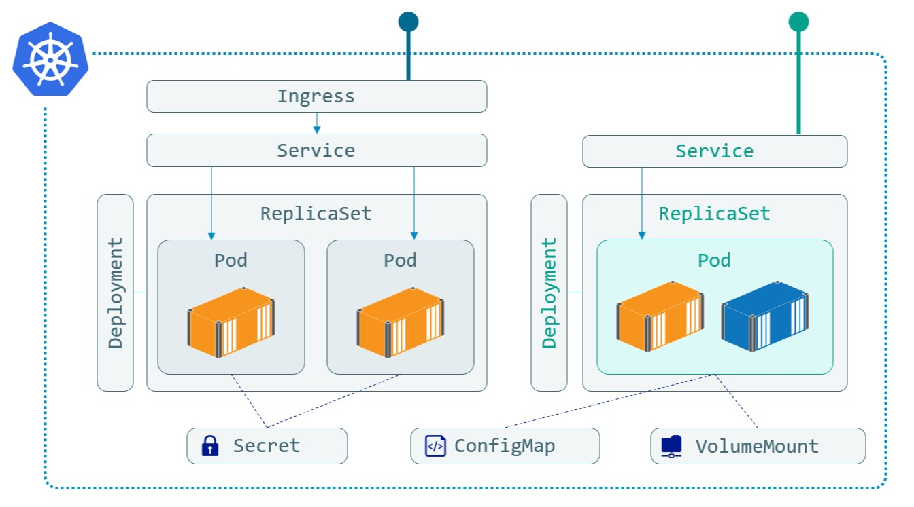

# Docker
Below notes are based on project [Docker and Kubernetes for .NET Developers](https://github.com/sixeyed/dak4.net) and presentation available on https://dak4.net and https://netdd19.dak4.net

# 1. Docker CLI:

## 1.1 Containers:
``` powershell
$imageName = repository/name/tag

docker container ls --all                                               # list all containers
docker container run $imageName                                         # run container
docker container run --interactive --tty --rm $imageName                # run container in interactive mode (-i) with terminal access (-t) and remove it after after closing
docker container run --detach --name $alias --publish 80:80 $imageName  # run container in detached/background mode on port :80
docker container top $alias                                             # check running processes inside container
docker container logs $alias                                            # check contaner logs
docker container exec (-it) $alias powershell "Get-Process"             # execute command inside container
docker container rm --force $(docker container ls --quiet --all)        # remove all containers (even still running)
exit                                                                    # exit container
docker export --output="latest.tar" $containerName			# export docker container to a *.tar file
```

## 1.2 Images:
``` powershell
docker login --username $dockerId                                       # login and push image to docker registry
docker image push $dockerId/$imageName
docker image build --tag $imageName --file $dockerfileNAME .            # build image from specified $dockerfileNAME in current directory (notice dot at the end)
docker images ls --all                                                  # list all images
```
## 1.3 [Dockerfile](https://docs.docker.com/engine/reference/builder/)

Some commands like RUN, ENVIRONMENT or CMD have 2 possible forms:
- shell form: RUN dotnet restore
- exec form: RUN ["dotnet", "restore"]

Differences between RUN, ENVIRONMENT and CMD

1. RUN - creates new layer in the image and runs command there
2. ENTRYPOINT - command that will be run when container starts
3. CMD (["param1","param2"]) - sets default command and/or parameters, which can be overwritten from command line when docker container runs. If you don't specify command, parameters will be added to ENTRYPOINT (there can be only 1 CMD instruction in Dockerfile)
	``` Dockerfile
	ENTRYPOINT ["/bin/echo", "Hello"]
	CMD ["world"]
	```

Example Dockerfile:
``` powershell
# escape=`								# escape character definition
FROM $imageName as $alias						# basic image name
WORKDIR C:\								# base workdir definition
COPY src/project ./project # or ADD					# ADD works the same but lets you copy from URL or archives 
RUN dotnet restore                                                     
ENTRYPOINT ["dotnet", "WebApplication.dll"]				# run 'dotnet WebApplication.dll' command on container start

SHELL ["powershell", "-Command", "$ErrorActionPreference = 'Stop';"]	# overrides default Shell, here sets it up to powershell
HEALTHCHECK --interval=2s `                                             # you can define HEALTHCHECK script that determines if container is ok or not
    CMD if ($response.StatusCode -eq 200) { return 0} `			# CMD allows you to override parameters (in this case powershell code) when running container
	 	else {return 1}						# because of specified shell, you can here write powershell code
```

\* There are images called **Multi arch images** (like mcr.microsoft.com/dotnet/core/sdk:3) which under the same image name have multiple architecture versions (Linux, Windows, ARM...) - this allows you to use one Dockerfile for all your devices.

# 2. Orchestrators
There are 2 most popular orchestrators: **Docker Swarm** (built in Docker) and **Kubernetes**. Both have similar architecture with 1 manager and many workers (usually over multiple phisical servers).<br>

Having orchestrator over your containers allow you to define environment specific: **configs**, **secrets**, **persistent storages (VolumeMount)** etc.<br> 

## 2.1 Docker swarm
``` powershell
docker swarm init --advertise-addr 127.0.0.1
docker swarm join --token $token - join your server to other swarm
docker service ls - all commands like for containers (services are an abstraction over containers)
docker service update --replicas=3 $serviceName
docker service update $updateType $serviceName
	--image $imageName - image update
	--replicas=3 - more replicas
docker service inspect $serviceName
docker service update --rollback $serviceName
docker service rm $serviceName
docker-compose -f .\core.yml -f .\prod.yml config > docker-stack.yml - join dokcer-compose files
docker config create $configName $configPath
docker config inspect --pretty $configName
docker secret create $secretName $secretPath
docker secret inspect --pretty $secretName
```

## 2.2 Docker-compose and yaml files:
``` powershell
docker-compose -f $yamlPath up -d                                       # run form file, "up" services, run as detached
docker-compose -f .\core.yml -f .\prod.yml config > docker-stack.yml    # combine 2 yaml files into one
```
Docker yaml example:
``` yaml
version: '1.0'

services:
  
  web-app:
    image: my/web-app
    environment: 
      ConnectionString: http://connectionString
      Dependencies:IDataLoader: WebApp.ReferenceData.DataLoader
    networks:
      - app-net
      
    # not allowed in Swarm mode
    labels:
      traefik.frontend.rule: PathPrefix:/app
    depends_on:
      - database
      
    # allowed only in Swarm mode
    configs:
      - source: log4net
    secrets:
     - source: connectionStrings
    healthcheck:
      retries: 3
      interval: 10s
      start_period: 40s
    deploy:
      replicas: 2
      labels:
        traefik.frontend.rule: PathPrefix:/app

  proxy:
    image: traefik:v1.7.18-windowsservercore-1809
    command: --docker --docker.endpoint=npipe:////./pipe/docker_engine --docker.watch --api
    ports:
      - "80:80"
      - "8080:8080"
    volumes:
      - type: npipe
        source: \\.\pipe\docker_engine
        target: \\.\pipe\docker_engine      
    networks:
      - app-net

networks:
  app-net:

# configs and secrets are allowed only in Swarm mode
configs:
  log4net:
    external: true

secrets:
  connectionStrings:
    external: true
```
Networking - default network for each container is its name - to access services between containers use their names **http://servicename:80** instead of http://localhost:80
<br><br><br>
Additionally Docker Swarm can use docker-compose yaml files with some additional attributes like: **healthcheck**, **configs**, **secrets** and **deploy**
``` powershell
docker stack deploy -c docker-stack.yml signup
```

## 2.3 Kubernetes
It's so popular because it's extensive (e.g. for secrets you can use your own sevice like Azure Key Vault) and fact that there are no real Docker Swarm managed services.<br>

Biggest difference between Kubernetes and other solutions is using one more wrapper/abstraction layer over set of containers - Pods.<br> 
One of adventages of having Pods is something called "sidecar relay" which allows you to spin up additional container to support your main container. For example, to output logs from container you need console log app for that. Using Kubernetes you can log to file and then set up additional small container (in the same Pod) only for reading logs from "main container" log file.

Additionally Kubernetes has its own UI/Dashboard for managing containers. But because it is fully editable it should not be exposed to public.

**Basci concepts:**<br>
- Deployment - manages ReplicaSet
- ReplicaSet - group of Pods
- Pod - abstractoion/wrapper over container(s)<br><br>
- Configuration files
- Secrets
- VolumeMount (persistent storage)
- Ingres
- Service
- LoadBalancer

<p align="center"> 

</p>

``` powershell
kubectl get nodes
kubectl get all
kubectl run $serviceName --image debian:9.11 --command ping -- localhost
kubectl scale --replicas=3 deployment/$serviceName
kubectl set image deployment/$serviceName $serviceName=debian:10.1
kubectl rollout history deployment/$serviceName
kubectl delete pods/rs --all --force --grace-period=0
kubectl delete deployment $serviceName
```

## 2.4 Kubernetes YAML
1. **Deplyoment** - every apps you run:
	- without defined **Service** - cannot be accessed by anything e.g event handlers
	- with defined **Service** - can be accessed:
		- with __ClusterIP__ - internally (database, helper APIs)
		- with __LoadBalancer__ - externally (log analytics, load balancer)
2. **Ingress** - allowing external trafic
3. **ServiceAccount** - enables access control

``` powershell
kubectl apply -f $yamlPath                                              # run service file by file or whole folder
```

### Application
```yaml
# Application
apiVersion: v1
kind: Service
metadata:
  name: web-app
spec:
  selector:    
    app: signup
    component: api
  ports:
  - name: http
    port: 80
    targetPort: 80
  type: ClusterIP
  
---

apiVersion: apps/v1
kind: Deployment
metadata:
  name: web-app
spec:
  selector:
    matchLabels:
      app: signup
      component: api
  template:
    metadata:
      labels:
        app: signup
        component: api
    spec:
      containers:
      - image: my/web-app
        name: web-app
        env:
        - name: ConnectionStrings
          value: "http://connectionStrings"
        ports:
        - containerPort: 80
          name: http
      nodeSelector:
        beta.kubernetes.io/os: linux
```
### Ingress
```yaml
# Ingress
apiVersion: extensions/v1beta1
kind: Ingress
metadata:
  name: signup
  annotations:
    kubernetes.io/ingress.class: traefik
    traefik.frontend.rule.type: PathPrefix
spec:
  rules:
  - host: localhost
    http:
      paths:
      - path: /
        backend:
          serviceName: homepage
          servicePort: http
```
### ServiceAccount
```yaml
# ServiceAccount - reverse proxy
apiVersion: v1
kind: ServiceAccount
metadata:
  name: traefik-ingress-controller
  namespace: kube-system
  
---

kind: Service
apiVersion: v1
metadata:
  name: traefik-ingress-service
  namespace: kube-system
spec:
  selector:
    k8s-app: traefik-ingress-lb
  ports:
    - protocol: TCP
      port: 80
      name: http
    - protocol: TCP
      port: 8080
      name: admin
  type: LoadBalancer
  
---

kind: Deployment
apiVersion: extensions/v1beta1
metadata:
  name: traefik-ingress-controller
  namespace: kube-system
  labels:
    k8s-app: traefik-ingress-lb
spec:
  replicas: 1
  selector:
    matchLabels:
      k8s-app: traefik-ingress-lb
  template:
    metadata:
      labels:
        k8s-app: traefik-ingress-lb
        name: traefik-ingress-lb
    spec:
      serviceAccountName: traefik-ingress-controller
      terminationGracePeriodSeconds: 60
      containers:
      - image: traefik:1.7.18-alpine
        name: traefik-ingress-lb
        ports:
        - name: http
          containerPort: 80
        - name: admin
          containerPort: 8080
        args:
        - --api
        - --kubernetes
        - --logLevel=INFO

```
